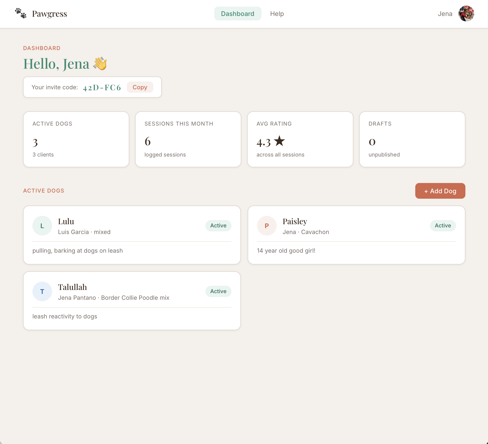
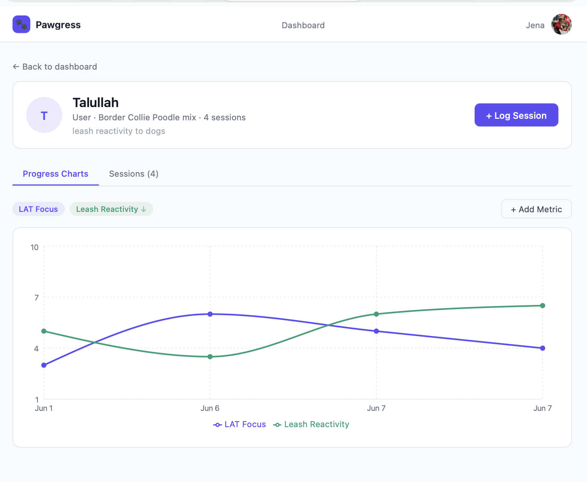
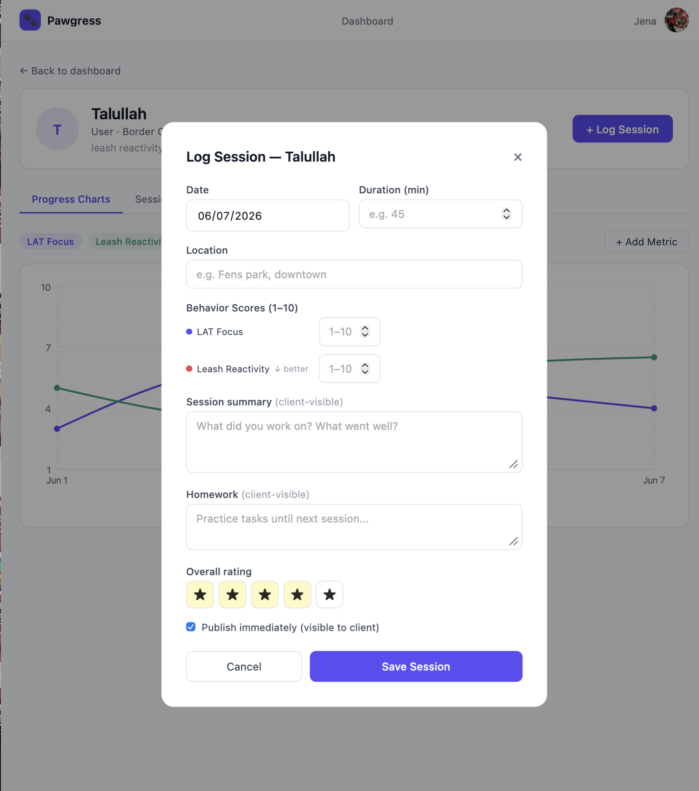
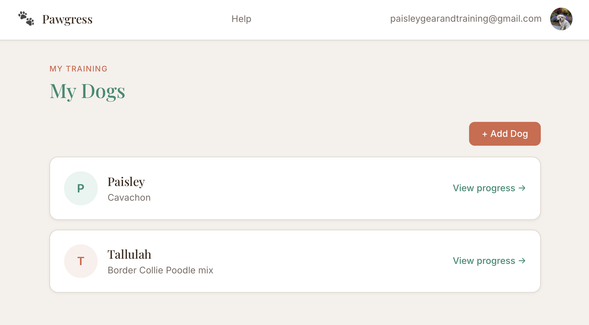

# Pawgress 🐾

A full-stack dog training management platform for professional trainers and their clients.

Trainers manage client dogs, log sessions, track behavior metrics, write day training reports, and assign homework. Dog owners log in to see their dog's progress, complete their intake form, log daily practice, track their streak, and follow their dog's skill map — all in one place.

**Live demo:** https://pawgress-eight.vercel.app  
**Built by:** [Jena Pantano](https://github.com/jpantano30) · [Paisley Dog Gear & Training](https://paisleydoggearandtraining.com)

---

## Screenshots

### Trainer Dashboard


### Dog Profile & Behavior Charts


### Homework Tracker with Streaks


### Client Portal


---

## Tech Stack

| Layer | Technology |
|---|---|
| Frontend | React 18, React Router, Recharts, Vite |
| Backend | Node.js, Express |
| Database | PostgreSQL (Neon) |
| Auth | Clerk (two-role: trainer / client) |
| Email | Resend |
| Hosting | Vercel (frontend) + Railway (backend) |
| Fonts | Playfair Display + Inter (Google Fonts) |

---

## Features

### Trainer Portal
- Dashboard with active client dogs, session stats, avg rating, draft count
- **Trainer invite code** — clients enter it to connect their account
- **Dog codes** — each dog gets a unique code (e.g. `PAI-X4K`); clients enter it to claim an existing dog record instead of creating a duplicate
- Add client dogs with owner info
- Define custom behavior metrics per dog (name, scale, color, direction)
- Log training sessions with behavior scores, notes, homework, star rating, publish/draft control
- **Day training report builder** — autosaves as you go, fill in sections throughout the day, publish when ready. Clients see a countdown to next session.
- **Cue/trick tracker** — add cues per dog, rate fluency: 🌱 Introduced → 📚 Learning → 💪 Reliable → ⭐ Proofed → 🏆 Mastered
- **Client intake form** — full 8-section intake (health, background, training history, behavior, tools, goals). Send clients a shareable link or fill it in yourself.
- Email notifications on session publish, report publish, and intake completion
- Skeleton loading states and error banners with retry throughout

### Client Portal
- **Warm first-time welcome walkthrough** — 4-step guided tour, skippable, shows once
- **Dog code claim flow** — clients choose between claiming an existing dog (via code) or adding a new one, preventing duplicates
- **Homework tracker** — daily practice log with 7-day calendar grid, tap to mark practiced
- **Streak system** — ⭐ 3 days, 🔥 7 days, 🏆 14 days with confetti celebration on first daily log
- **Progress summary cards** — auto-generated insights: biggest metric improvement %, mastered cues, session count, streak
- **Cue tracker** — clients can add and rate their own cues, not just view trainer's
- View published session reports with homework callout
- Send practice notes to trainer from the homework log
- Fill out intake form directly in the app
- Email notifications for new session notes, reports, and homework

### Shared
- Role-based auth — trainers and clients see completely different UIs
- **Help guide** — role-specific accordion guide (8 sections each) accessible from nav
- Confetti when logging practice or leveling up a cue to Proofed/Mastered
- Mobile-responsive layout

---

## Architecture

```
pawgress/
├── client/                 # React frontend (Vite)
│   └── src/
│       ├── components/
│       │   ├── trainer/    # LogSessionModal, AddDogModal, EditDogModal, SessionDetail, AddMetricModal
│       │   ├── client/     # HomeworkTracker, AddClientDogModal
│       │   └── shared/     # BehaviorChart, CueTracker, IntakeForm, WelcomeModal,
│       │                     ProgressSummary, Confetti, ErrorBanner, SkeletonCard, Layout
│       ├── hooks/          # useRole, useApi
│       └── pages/          # TrainerDashboard, DogProfile, ReportBuilder, TrainerIntakePage,
│                             ClientDashboard, ClientDogView, ClientIntakePage, HelpPage
└── server/                 # Express API
    ├── routes/             # dogs, sessions, metrics, users, homework, reports, cues
    ├── utils/              # email.js (Resend)
    ├── middleware/         # requireRole
    └── db/                 # schema + migration files
```

---

## Database Schema

10 tables: `users`, `trainer_clients`, `dogs`, `behavior_metrics`, `sessions`, `behavior_scores`, `homework_logs`, `session_reports`, `dog_cues`, and intake data stored as JSONB on the `dogs` table.

Key design decisions:
- Users managed by Clerk, mirrored in DB with `role` and `invite_code` columns
- Trainer invite codes and dog codes auto-generated on creation (`ABC-123` format)
- Dog codes allow clients to claim existing dog records without seeing other dogs
- Behavior metrics fully configurable per dog with directional scales
- Sessions and scores inserted transactionally
- Session reports store sections as JSONB for flexible day-training format
- Cue fluency tracked 1–5 with labeled levels
- Email sends are fire-and-forget (non-blocking) so API never fails due to email issues

---

## Local Development

### Prerequisites
- Node.js 18+
- [Neon](https://neon.tech) PostgreSQL database
- [Clerk](https://clerk.com) application
- [Resend](https://resend.com) account (optional — emails log to console in dev)

### Setup

```bash
git clone https://github.com/jpantano30/pawgress.git
cd pawgress

cd server && npm install
cd ../client && npm install

cp .env.example server/.env
cp .env.example client/.env
# Fill in DATABASE_URL, CLERK keys, and optionally RESEND_API_KEY
```

Run all SQL files in `server/db/` in Neon's SQL editor in order:
1. `schema.sql`
2. `add_features.sql`
3. `add_next_session.sql`
4. `add_intake.sql`
5. `add_cues.sql`
6. `add_dog_code.sql`

```bash
cd server && npm run dev   # :3001
cd client && npm run dev   # :5173
```

### Environment Variables

**server/.env**
```
DATABASE_URL=postgresql://...
CLERK_SECRET_KEY=sk_test_...
CLIENT_URL=http://localhost:5173
NODE_ENV=development
PORT=3001
RESEND_API_KEY=re_...        # optional in dev
```

**client/.env**
```
VITE_CLERK_PUBLISHABLE_KEY=pk_test_...
VITE_API_URL=http://localhost:3001
```

---

## Roadmap

- [ ] PDF session report export
- [ ] Stripe subscription for premium tier
- [ ] Photo uploads for dog profiles
- [ ] Push notifications (mobile PWA)
- [ ] Multi-trainer support per dog

---

Built by [Jena Pantano](https://github.com/jpantano30) · [Paisley Dog Gear & Training](https://paisleydoggearandtraining.com)
